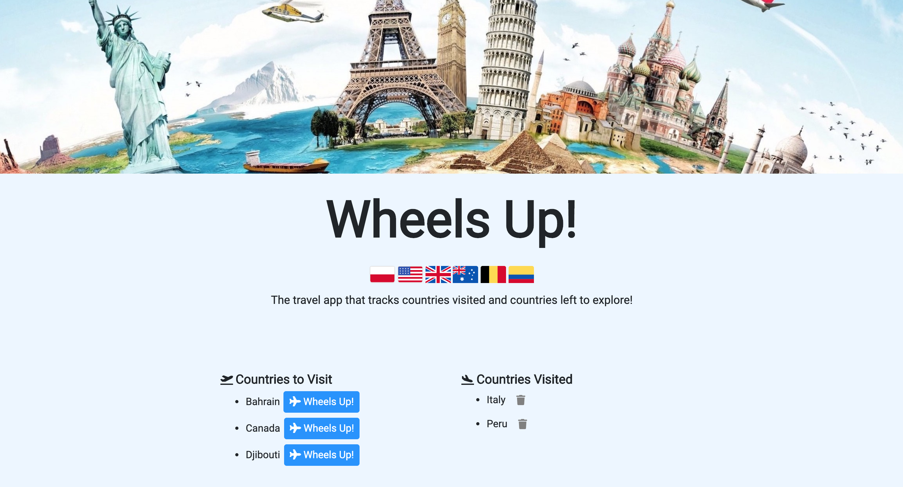
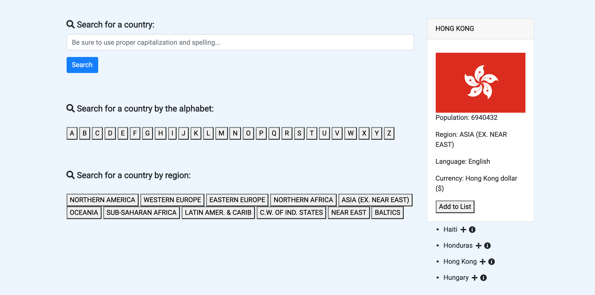
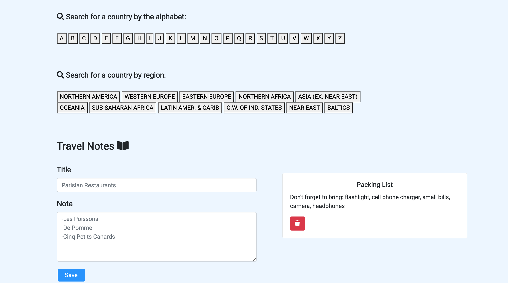

# Wheels Up
This appplication tracks countries that users have visited and countries they want to visit in the future. Users can search by first letter, world region, or by typing in the name of a country. Once searched, a list of countries display that fit the search criteria. The user can then add it to the list of countries they want to visit or they can see more information about that country (flag image, currency, language, etc.). Users can also make notes about their travels or travel plans at the bottom of the app as well.

## Deployment
The application is deployed on Heroku [here](https://wheels-up.herokuapp.com/).

## Features
* Search for a country by name
* Search for a country by clicking the first letter of the alpha 
* Search for a country by region 
* Add a country to a list of places to visit
* Move a country to a list of places visited 
* Write a note about a country or a place 

## Screen shots of the application 

## Contributors
Ahmed Bule

Benjamin Vasko

Cassandra Perez

Chue Yang 

Jonathan Montreuil

